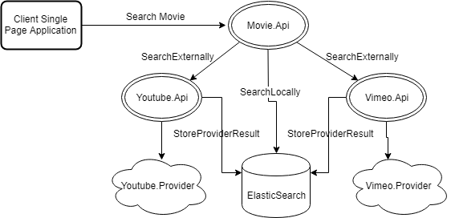

# movieTrailerApi - Microservices Architecture and Containers based Application

### Architecture overview 

The architecture proposes a microservice oriented architecture implementation with multiple microservices and implementing CQS approach. 
Curent implementation provides 3 apis: Movie.Api, Youtube.Api and Vimeo.Api.
When client App send a request to search for a movie, Movie.Api tries to find the movie in the local ElasticSearch storage.
If no data is present locally, api will call Youtube.Api and Vimeo.Api to request Youtube and Vimeo providers.When data is retrieved from providers, the result is returned to Movie.Api and back to the Client App. In meantime a backgroud task is running async to store the provider search result inside ElasticSearchStorage.
Since each provider (Youtube,Vimeo,etc) stores data in a specific way, each provider api like (Youtube.Api, Vimeo.Api, any other futureProvider.Api) is hosted as a separate service and is responsible to extract, transform and load provider data into the local storage (ElasticSearch in our case). 
We can add a new provider api in the future, without changing any existing code. Once new provider api is ready, we need to update Movie.Api settings to include the additional url resource to read data from.

## How to run
In the root project folder run the following command
- docker-compose up -d

## Following docker containers will start:
- Movie.Api (to search for movie into elasticsearch)
- Youtube.Api (extract,transform and load (ETL) data from Youtube)
- Vimeo.Api (ETL data from Vimeo`)
- ElasticSearch (Local storage)
- Kibana (Nice web interface to interact with ElasticSearch storage)

Once all containers started, open http://localhost:5000 in browser and search for your favourite movie trailer.

